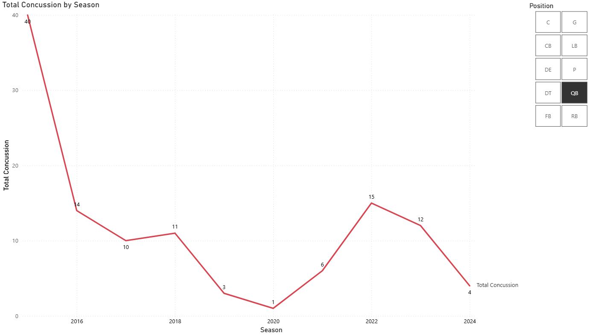

# 🏈 NFL Safety & Injury Analysis (2015-2024)

## 🚀 Project Evolution (v1 vs. v2)
**Why this project exists:**
This analysis began as a personal investigation ("Version 1") into CTE and head trauma to determine if football was safe for my future children.
* **Version 1 (The Pilot):** I initially analyzed a manual sample of just **9 specific players**. While interesting, I realized this small sample size introduced bias and couldn't accurately reflect league-wide safety trends.
* **Version 2 (Current):** To get the truth, I scaled the project up by building a SQL database containing **every reported injury from 2015 to 2024** (thousands of rows). This transition allowed me to move from anecdotal evidence to statistical significance.

## 📊 Key Findings
* **Concussions are down ~75%:** Analysis of the 10-year dataset shows reports dropped from **656** (2015) to **~152** (2024). This steep decline correlates strongly with the 2018 Targeting Rule and the introduction of Guardian Caps.
* **"Skill" Positions are High Risk:** Wide Receivers (WR) and Tight Ends (TE) suffer the highest volume of concussions due to high-speed open-field collisions.
* **QB Recovery Time:** While Quarterbacks are protected by rules, when injured, they miss significant time (avg ~3 weeks), with **Shoulder** and **Back** injuries being the primary causes.

## 📊 Visuals & Interactive Dashboard

### 1. Executive Summary (League-Wide Trend)
*The total number of concussions has dropped ~75% since 2015.*


### 2. Position Analysis (Interactive Slicer)
*The Power BI dashboard allows filtering by position. Below is the view filtered specifically for **Quarterbacks**, showing the impact of the 2018 "Roughing the Passer" rule changes.*


*(Note: Live Power BI link is restricted due to organizational security policies).*

## 🛠️ Tech Stack
* **SQL (MySQL):** Used `GROUP BY`, `HAVING`, and `COUNT(DISTINCT)` to normalize injury duration and filter out low-sample anomalies.
* **Python:** Built a bridge to the database using `mysql.connector` and visualized the 10-year concussion trend with `matplotlib`.
* **VS Code:** Integrated development environment for script automation.

## 💻 How to Run
1.  Update database credentials in `concussion_trend.py`.
2.  Run the analysis script:
    ```bash
    python concussion_trend.py

    ```

